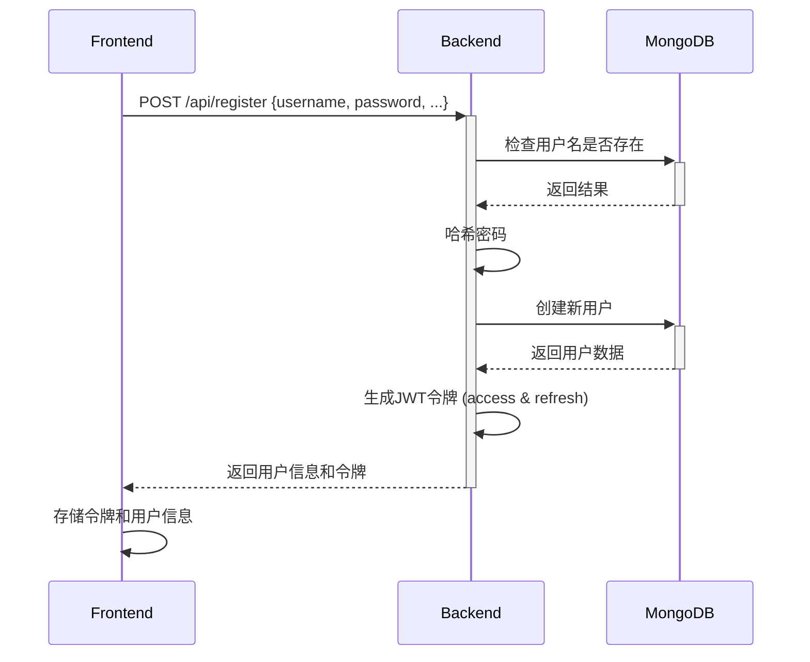
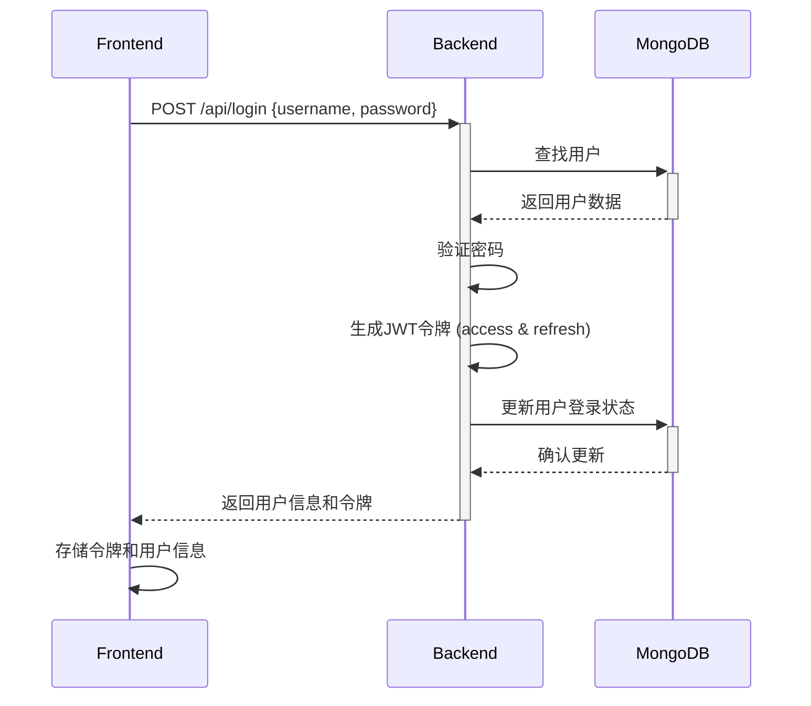
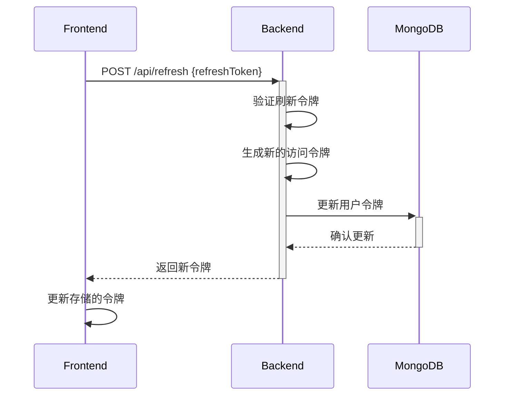
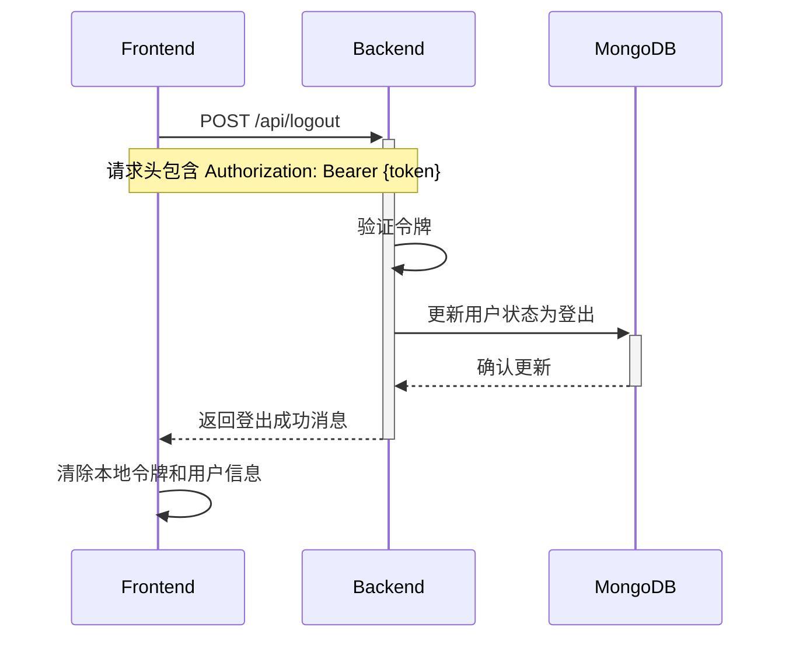
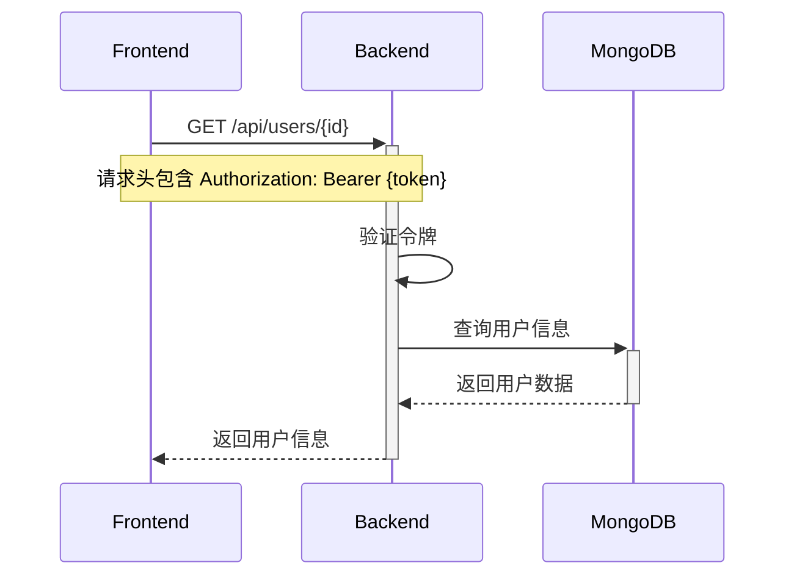
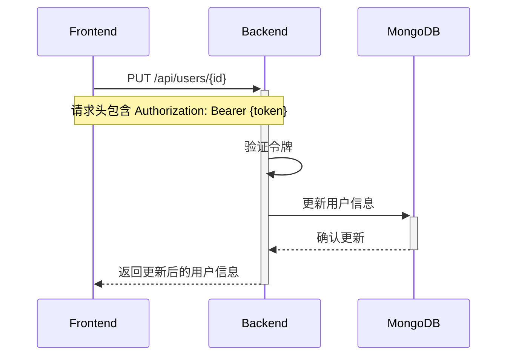
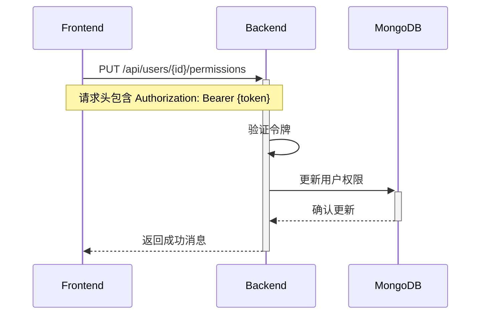
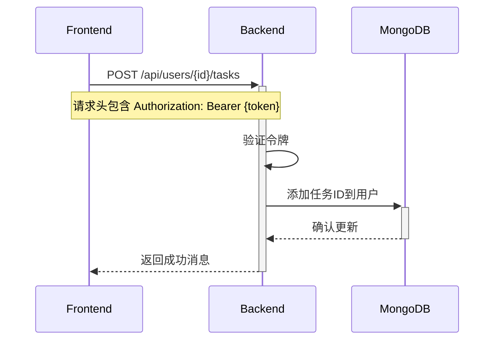
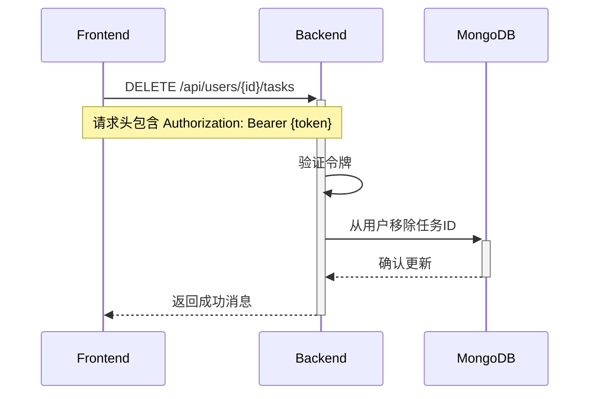

# TrickleDown-todolist
移动应用软件开发项目

## 一、项目概述

- 项目名称
  + 我们的项目名称为`TrickleDown-todolist`
  + 项目地址为`https://github.com/Alchuang22-dev/TrickleDown-todolist.git`

- 项目背景与意义
  - 我们注意到目前热门的TODO-list型软件（如`滴答清单`，`番茄todo`等）在面向用户的便利性和图形化的展示界面方面仍然存在一些不足，因此计划开发一款功能完备、设计简洁的轻量级待办清单软件。
- 项目目标
  - 我们希望结合TODO-list的优势（如任务管理的简洁性）和手账型软件的优势（如任务自定义的丰富性），设计适用于用户日常生活需求的实用型工具。
- 开发团队
- 开发进度概述

## 二、需求分析

### 1. 系统角色

我们的项目暂定分为两种用户角色，包含

- 普通用户
- 管理员用户

### 2. 用户故事

由于我们所创建的待办事项APP在市场具备较为成熟的方案，基本的用户故事包括：

- 作为用户，我希望能创建待办事项，以便记录需要完成的任务
- 作为用户，我希望能设置任务优先级和截止日期，以便合理规划时间
- 作为用户，我希望能对任务进行分类管理，以便更好地组织不同类型的任务
- 作为用户，我希望能接收任务到期提醒，以免错过重要事项
- 作为用户，我希望能查看任务完成统计，以了解自己的工作效率
- 作为管理员，我希望能管理用户账户，以确保系统正常运行

### 3. 功能点清单

#### 3.1 用户信息管理

+ 用户的注册、登录和登出
+ 用户个人信息编辑、保存、修改

### 3.2 任务管理

+ 任务状态：创建、删除、标记完成、解除标记完成
+ 编辑任务内容：标题、详情
+ 任务属性：时间（必有日期、可选时间点或时段）、地点（可选）、分类标签（有默认选项，可另行自定义）、优先级（重要or普通）
+ 任务排序：时间顺序，制作可视化时间轴（类似研讨室预约）
+ 任务筛选：默认查看全部事项，可使用未完成筛选（所有未完成的任务）、完成筛选（所有已完成的任务）、优先级筛选（所有重要事项）、类别筛选（提供所有标签供用户选择）、时间范围筛选（截止时间）；在主页单独设置今日任务列表
+ **重叠处理**：
  + 把一天视为时间轴，按5分钟划分为小时间段；一天内的重要事项不可重叠；
  + 允许一天内除重要事项外，同一时段最多重叠4个事项（重要事项单独置于最左一列，其余事项可占用右侧四列；添加事项时，若为重要事项，则检测重要事项列是否有空闲，无空闲则提醒需要更换时间或修改优先级；若非重要事项，则检测事项所需的时间段，自动最左填充，先考虑最左侧列是否有空闲时间，若没有则顺延；若同一时段重叠非重要事项超过4个，提醒事项过多，不允许新添加；若事项仅精确到日期、未精确到时间点或时间段，不放到本列表中，放置到今日事项中并显示距离目标日期还剩几天）
+ **任务视图**：
  + 提供今日任务（包含仅精确到日期、未精确到时间点或时间段的事项）；
  + 可选列表视图（默认按截止时间顺序展示所有事项，每页最多展示8-10个，可换页；可进行任务筛选）、看板视图（类似info的周视图；一天一列，每列仅展示重要事项；点击日期tab可进入该日详情，展示上面提到的重叠列表）

### 3.3 提醒系统

+ 包含推送通知+闹钟双提醒方式
+ 可选择是否对某一事项进行提醒
+ 可选择是否对某一事项周期提醒（每日、每周、每月、每年等）

### 3.4 数据统计

+ 今日完成率和累计完成率统计
+ 准时完成率和延后完成率统计
+ 其他的个性化分析

### 3.5 数据同步

+ 云端存储和多设备同步

## 三、界面设计

### 1. 登录与注册界面

- 暂未实现

### 2. 主界面


### 3. 今日任务界面


### 4. 计划看板界面


### 5. 全部任务界面


### 6. 数据统计界面


### 7. 添加任务


### 8. 用户界面


## 四、关键Activity及实现方式

### 1. 登录与注册Activity

- 实现方法与流程
  - 我们预期将实现账户/密码登录和微信登录两种登录方式
  - 关于账户/密码登录的微信登录，我们在软件工程项目中已经完成了相应的方法

- 关键技术点
  - user数据库和更新处理与token的自动更新和检测


### 2. 主界面Activity

- 实现方法与流程
  - 我们预期在主界面中展示用户所有的待办任务，以列表或卡片的方式呈现。
  - 通过RecyclerView搭配自定义Adapter实现高效的任务数据展示。
  - 用户可以通过下拉刷新控件（SwipeRefreshLayout）手动刷新任务列表。
- 关键技术点
  - 使用ViewModel搭配LiveData管理任务数据，确保数据与界面自动保持同步。
  - 数据异步加载：通过Coroutine或RxJava实现数据的异步加载，避免阻塞主线程，确保界面流畅。

### 3. 任务管理Activity

- 实现方法与流程
  - 提供CRUD（创建、读取、更新、删除）操作界面，允许用户对任务进行便捷管理。
  - 使用FloatingActionButton (FAB) 或标准按钮跳转到任务创建或编辑界面。
- 关键技术点
  - 任务状态管理：在任务数据模型中添加明确的状态标记（如“待完成”、“进行中”、“已完成”），在数据库和本地缓存中进行相应标记。
  - 使用Room数据库持久化任务信息，并在CRUD操作完成后自动更新ViewModel中对应的LiveData，保证数据实时同步。

### 4. 提醒服务

- 本地提醒实现方式
  - 闹钟：我们会使用`AlarmManager`监听用户任务的进程；在用户同意的情况下，我们将会向最近任务应用中添加白名单，将需要的应用添加到白名单中，保持应用进程在后台持续运行。
  - 通知：我们会使用`NotificationManager`设置通知内容，在本地对用户进行提醒。

- 推送通知实现方案
  - 日历维护：在获取日历权限后，我们会使用`ContentValues`和`ContentResolver`在服务器维护一个`Android Calendar`的对象，使用Android日历功能将用户的待办事项进行云同步，即使用户在本地完全关闭应用，也可以收到通知。


### 5. 数据同步Activity

- 实现方法与流程
  - 提供云端数据同步功能，允许用户主动触发数据同步或自动执行后台同步任务。
  - 使用RESTful API实现与云端服务器的数据交互。
- 关键技术点
  - 同步策略：使用WorkManager定期执行数据同步任务，并利用网络约束条件（如仅WiFi下同步），提升效率并减少流量消耗。
  - 冲突解决方案：在本地和服务器端记录数据版本或时间戳，当数据冲突时，采用“最近一次修改优先”原则或提供手动选择冲突处理的界面，由用户确定最终同步版本。

## 五、项目主要模块设计

### 1. 前端模块

我们的前端主要使用Kotlin语言进行设计，利用Jetpack实现数据交流和后端通信。

- UI组件架构
  - **Jetpack Compose** - Google推荐的现代声明式UI工具包，能轻松实现拖拽功能和复杂动画
- 状态管理方案
  - **Kotlin Flow/StateFlow** - 响应式编程处理应用状态（现阶段我们已经转向Java开发）
  - **LiveData** - 生命周期感知的数据持有者类
- 路由导航设计
  - **Jetpack Navigation** - 简化Fragment间导航，支持安全参数传递
- 本地存储设计
  - **DataStore**
- 前端框架
  - 如时间资源允许，可能采用**React**，目前仍直接与后端进行数据通信


### 2. 后端模块

- 数据模型设计
  - 我们目前只完成了`Task`类和`User`类以及包含的方法
- API接口设计
  - 请参见我们的Apifox文档[TrickleDown Api](https://app.apifox.com/project/6233887)
- 数据库结构
  - 我们目前使用**MongoDB**作为数据库
- 服务器架构
  - 我们正在使用的服务器后端为Ubuntu上的**Gin/Gorm**架构www.todo.dechelper.com


### 3. 数据流设计

我们将以User类为例说明前后端之间的数据流设计。

#### 系统概述

本文档描述了基于Go后端和Kotlin/Compose前端的待办事项应用（Todo App）的前后端交互流程和数据流设计。应用采用RESTful API架构，使用JWT进行身份验证，MongoDB作为数据存储。

#### 架构图

```
┌─────────────────┐      HTTP/REST      ┌─────────────────┐      ┌─────────────────┐
│                 │  Request/Response   │                     │      │                 │
│  Kotlin/Compose │◄─────────────────►│    Go Backend    │◄────►│    MongoDB      │
│  Frontend       │                     │                             │      │                 │
└─────────────────┘                               └─────────────────┘      └─────────────────┘
       ▲                                       │
       │                                       │
       └───────────────────────────────────────┘
                 JWT Authentication
```

#### 认证流程

##### 1. 用户注册



###### 数据流：

**请求体：**

```json
{
  "username": "user123",
  "password": "securepassword",
  "nickname": "Cool User",
  "email": "user@example.com",
  "phoneNumber": "1234567890"
}
```

**响应体：**

```
{
  "message": "注册成功",
  "user": {
    "id": "6071a2d35c6fe22ae123456",
    "username": "user123",
    "nickname": "Cool User",
    "email": "user@example.com",
    "status": "REGISTERED"
  },
  "token": {
    "accessToken": "eyJhbGciOiJIUzI1...",
    "refreshToken": "eyJhbGciOiJIUzI1...",
    "expiresIn": 86400
  }
}
```

##### 2. 用户登录



###### 数据流：

**请求体：**

json

复制

```
{
  "username": "user123",
  "password": "securepassword"
}
```

**响应体：**

json

复制

```
{
  "message": "登录成功",
  "user": {
    "id": "6071a2d35c6fe22ae123456",
    "username": "user123",
    "nickname": "Cool User",
    "email": "user@example.com",
    "phoneNumber": "1234567890",
    "avatarURL": "https://example.com/avatar.jpg",
    "status": "LOGGED_IN",
    "createdDate": "2023-04-10T12:00:00Z",
    "lastLoginDate": "2023-04-15T09:30:00Z",
    "taskIds": ["6071a2d35c6fe22ae654321", "6071a2d35c6fe22ae654322"]
  },
  "token": {
    "accessToken": "eyJhbGciOiJIUzI1...",
    "refreshToken": "eyJhbGciOiJIUzI1...",
    "expiresIn": 86400
  }
}
```

##### 3. 令牌刷新



###### 数据流：

**请求体：**

json

复制

```
{
  "refreshToken": "eyJhbGciOiJIUzI1..."
}
```

**响应体：**

json

复制

```
{
  "token": {
    "accessToken": "eyJhbGciOiJIUzI1...",
    "refreshToken": "eyJhbGciOiJIUzI1...",
    "expiresIn": 86400
  }
}
```

### 4. 用户登出



###### 数据流：

**响应体：**

```json
{
  "message": "Successfully logged out"
}
```

#### 用户资源管理

##### 1. 获取用户信息



###### 数据流：

**响应体：**

```json
{
  "id": "6071a2d35c6fe22ae123456",
  "username": "user123",
  "nickname": "Cool User",
  "email": "user@example.com",
  "phoneNumber": "1234567890",
  "avatarURL": "https://example.com/avatar.jpg",
  "status": "LOGGED_IN",
  "createdDate": "2023-04-10T12:00:00Z",
  "lastLoginDate": "2023-04-15T09:30:00Z",
  "permissions": {
    "ALARM": false,
    "NOTIFICATION": true,
    "LOCATION": false,
    "STORAGE": true,
    "CALENDAR": false,
    "CONTACTS": false
  },
  "preferences": {
    "theme": "dark",
    "language": "zh-CN",
    "notificationEnabled": true
  },
  "taskIds": ["6071a2d35c6fe22ae654321", "6071a2d35c6fe22ae654322"]
}
```

###### 2. 更新用户信息



###### 数据流：

**请求体：**

```json
{
  "nickname": "Super User",
  "email": "newuser@example.com",
  "avatarURL": "https://example.com/new-avatar.jpg"
}
```

**响应体：**
 与获取用户信息响应相同，但包含更新后的数据。

##### 3. 更新用户权限



###### 数据流：

**请求体：**

```json
{
  "permissionType": "NOTIFICATION",
  "enabled": true
}
```

**响应体：**

```json
{
  "message": "Permission updated"
}
```

#### 任务管理

##### 1. 获取用户任务列表


###### 数据流：

**响应体：**

```json
{
  "tasks": ["6071a2d35c6fe22ae654321", "6071a2d35c6fe22ae654322"]
}
```

##### 2. 添加任务到用户



#### 数据流：

**请求体：**

```json
{
  "taskId": "6071a2d35c6fe22ae654323"
}
```

**响应体：**

```json
{
  "message": "Task added to user"
}
```

##### 3. 从用户移除任务



###### 数据流：

**请求体：**

json

复制

```
{
  "taskId": "6071a2d35c6fe22ae654323"
}
```

**响应体：**

json

复制

```
{
  "message": "Task removed from user"
}
```

#### 前端实现(Kotlin/Compose)

##### 1. API客户端

使用Kotlin的Retrofit库创建API客户端：

```kotlin
// API接口定义
interface TodoApiService {
    @POST("api/register")
    suspend fun registerUser(@Body registerRequest: RegisterRequest): Response<AuthResponse>
    
    @POST("api/login")
    suspend fun loginUser(@Body loginRequest: LoginRequest): Response<AuthResponse>
    
    @POST("api/refresh")
    suspend fun refreshToken(@Body refreshRequest: RefreshRequest): Response<TokenResponse>
    
    @POST("api/logout")
    suspend fun logout(@Header("Authorization") token: String): Response<MessageResponse>
    
    @GET("api/users/{id}")
    suspend fun getUserById(@Path("id") userId: String, @Header("Authorization") token: String): Response<User>
    
    // 其他API方法...
}

// 创建Retrofit实例
val retrofit = Retrofit.Builder()
    .baseUrl("https://your-api-server.com/")
    .addConverterFactory(GsonConverterFactory.create())
    .build()

val apiService = retrofit.create(TodoApiService::class.java)
```

##### 2. 数据模型

定义与后端对应的数据模型：

```kotlin
// 用户模型
data class User(
    val id: String,
    val username: String,
    val nickname: String,
    val email: String,
    val phoneNumber: String?,
    val avatarURL: String?,
    val status: String,
    val createdDate: String,
    val lastLoginDate: String?,
    val permissions: Map<String, Boolean>,
    val preferences: Map<String, Any>,
    val taskIds: List<String>
)

// 认证响应
data class AuthResponse(
    val message: String,
    val user: User,
    val token: TokenResponse
)

data class TokenResponse(
    val accessToken: String,
    val refreshToken: String,
    val expiresIn: Long
)

// 请求模型
data class RegisterRequest(
    val username: String,
    val password: String,
    val nickname: String?,
    val email: String?,
    val phoneNumber: String?
)

data class LoginRequest(
    val username: String,
    val password: String
)

data class RefreshRequest(
    val refreshToken: String
)

// 其他模型...
```

##### 3. 令牌管理

```kotlin
class TokenManager(private val context: Context) {
    private val prefs = context.getSharedPreferences("auth_prefs", Context.MODE_PRIVATE)
    
    fun saveTokens(accessToken: String, refreshToken: String, expiresIn: Long) {
        with(prefs.edit()) {
            putString("access_token", accessToken)
            putString("refresh_token", refreshToken)
            putLong("expires_at", System.currentTimeMillis() + expiresIn * 1000)
            apply()
        }
    }
    
    fun getAccessToken(): String? = prefs.getString("access_token", null)
    
    fun getRefreshToken(): String? = prefs.getString("refresh_token", null)
    
    fun isTokenExpired(): Boolean {
        val expiresAt = prefs.getLong("expires_at", 0)
        return System.currentTimeMillis() > expiresAt
    }
    
    fun clearTokens() {
        prefs.edit().clear().apply()
    }
    
    fun getAuthHeader(): String? {
        val token = getAccessToken()
        return if (token != null) "Bearer $token" else null
    }
}
```

##### 4. 存储库模式

```kotlin
class UserRepository(
    private val apiService: TodoApiService,
    private val tokenManager: TokenManager
) {
    suspend fun registerUser(username: String, password: String, nickname: String? = null,
                             email: String? = null, phoneNumber: String? = null): Result<User> {
        return try {
            val request = RegisterRequest(username, password, nickname, email, phoneNumber)
            val response = apiService.registerUser(request)
            
            if (response.isSuccessful) {
                response.body()?.let { authResponse ->
                    tokenManager.saveTokens(
                        authResponse.token.accessToken,
                        authResponse.token.refreshToken,
                        authResponse.token.expiresIn
                    )
                    Result.success(authResponse.user)
                } ?: Result.failure(Exception("Empty response body"))
            } else {
                Result.failure(Exception(response.errorBody()?.string() ?: "Unknown error"))
            }
        } catch (e: Exception) {
            Result.failure(e)
        }
    }
    
    suspend fun loginUser(username: String, password: String): Result<User> {
        // 类似registerUser的实现
    }
    
    suspend fun refreshTokenIfNeeded(): Boolean {
        if (tokenManager.isTokenExpired()) {
            val refreshToken = tokenManager.getRefreshToken() ?: return false
            
            try {
                val response = apiService.refreshToken(RefreshRequest(refreshToken))
                if (response.isSuccessful) {
                    response.body()?.let { tokenResponse ->
                        tokenManager.saveTokens(
                            tokenResponse.accessToken,
                            tokenResponse.refreshToken,
                            tokenResponse.expiresIn
                        )
                        return true
                    }
                }
                return false
            } catch (e: Exception) {
                return false
            }
        }
        return true
    }
    
    suspend fun getUserById(userId: String): Result<User> {
        if (!refreshTokenIfNeeded()) {
            return Result.failure(Exception("Authentication required"))
        }
        
        return try {
            val authHeader = tokenManager.getAuthHeader() ?: 
                return Result.failure(Exception("No auth token"))
                
            val response = apiService.getUserById(userId, authHeader)
            
            if (response.isSuccessful) {
                response.body()?.let { user ->
                    Result.success(user)
                } ?: Result.failure(Exception("Empty response body"))
            } else {
                Result.failure(Exception(response.errorBody()?.string() ?: "Unknown error"))
            }
        } catch (e: Exception) {
            Result.failure(e)
        }
    }
    
    // 其他用户相关操作...
}
```

##### 5. ViewModel集成

```kotlin
class UserViewModel(private val userRepository: UserRepository) : ViewModel() {
    
    private val _user = MutableStateFlow<User?>(null)
    val user: StateFlow<User?> = _user
    
    private val _loading = MutableStateFlow(false)
    val loading: StateFlow<Boolean> = _loading
    
    private val _error = MutableStateFlow<String?>(null)
    val error: StateFlow<String?> = _error
    
    fun register(username: String, password: String, nickname: String? = null,
                 email: String? = null, phoneNumber: String? = null) {
        viewModelScope.launch {
            _loading.value = true
            _error.value = null
            
            userRepository.registerUser(username, password, nickname, email, phoneNumber)
                .onSuccess { user ->
                    _user.value = user
                }
                .onFailure { exception ->
                    _error.value = exception.message
                }
            
            _loading.value = false
        }
    }
    
    fun login(username: String, password: String) {
        // 类似register的实现
    }
    
    fun logout() {
        // 实现用户登出
    }
    
    fun getUserById(userId: String) {
        // 获取用户详情
    }
    
    // 其他用户操作...
}
```

##### 6. Compose UI集成

```kotlin
@Composable
fun LoginScreen(viewModel: UserViewModel, onLoginSuccess: () -> Unit) {
    val userState by viewModel.user.collectAsState()
    val loadingState by viewModel.loading.collectAsState()
    val errorState by viewModel.error.collectAsState()
    
    var username by remember { mutableStateOf("") }
    var password by remember { mutableStateOf("") }
    
    LaunchedEffect(userState) {
        if (userState != null) {
            onLoginSuccess()
        }
    }
    
    Column(
        modifier = Modifier
            .fillMaxSize()
            .padding(16.dp),
        horizontalAlignment = Alignment.CenterHorizontally,
        verticalArrangement = Arrangement.Center
    ) {
        Text(
            text = "登录",
            style = MaterialTheme.typography.h4,
            modifier = Modifier.padding(bottom = 32.dp)
        )
        
        OutlinedTextField(
            value = username,
            onValueChange = { username = it },
            label = { Text("用户名") },
            modifier = Modifier.fillMaxWidth()
        )
        
        Spacer(modifier = Modifier.height(16.dp))
        
        OutlinedTextField(
            value = password,
            onValueChange = { password = it },
            label = { Text("密码") },
            visualTransformation = PasswordVisualTransformation(),
            modifier = Modifier.fillMaxWidth()
        )
        
        Spacer(modifier = Modifier.height(32.dp))
        
        if (errorState != null) {
            Text(
                text = errorState!!,
                color = MaterialTheme.colors.error,
                modifier = Modifier.padding(bottom = 16.dp)
            )
        }
        
        Button(
            onClick = { viewModel.login(username, password) },
            enabled = !loadingState && username.isNotEmpty() && password.isNotEmpty(),
            modifier = Modifier.fillMaxWidth()
        ) {
            if (loadingState) {
                CircularProgressIndicator(
                    color = MaterialTheme.colors.onPrimary,
                    modifier = Modifier.size(24.dp)
                )
            } else {
                Text("登录")
            }
        }
        
        Spacer(modifier = Modifier.height(16.dp))
        
        TextButton(onClick = { /* 跳转到注册页面 */ }) {
            Text("没有账号？点击注册")
        }
    }
}
```

## 六、当前遇到的问题与解决方案

### 1. 技术难点

- 多设备数据同步问题
- 离线使用与数据一致性问题
- 解决方案与进展
  - 考虑添加WebSocket支持


### 2. 开发过程中的挑战

- 用户体验优化问题
- 性能优化问题
- 解决方案与进展
  - 添加用户行为分析，帮助改进应用体验
  - 考虑添加AI api接口


### 3. 可能遇到的问题

- 数据安全与隐私保护
- 系统扩展性考虑
- 预防措施与应对方案
  - 暂无应对方案


## 七、下一阶段工作计划

- 功能开发计划
  - **第9周**：前框框架的kotlin/compose搭建；后端框架部署
  - **第10周**：User部分和Task部分基本功能的前后端连接
  - **第11周**：AI等辅助功能和复杂图形化界面最终实现

- 测试计划
  - **第12周**：基于测试的敏捷开发

- 发布时间表
  - **第13周**：最终发布


## 八、附录

- 技术栈说明
  - 前端：Kotlin/Jetpack Compose
  - 后端：Go/Gin+Gorm, with Docker
- 开发环境配置
  - 前端：Android Studio/Ubuntu 24.04/Windows 11/Android 13
  - 后端：Docker/Ubuntu 24.04
- API文档：[TrickleDown Api](https://app.apifox.com/project/6233887)
- 数据库设计文档：本项目数据库较为简单，且采用非关系型数据库，因此不设置文档。