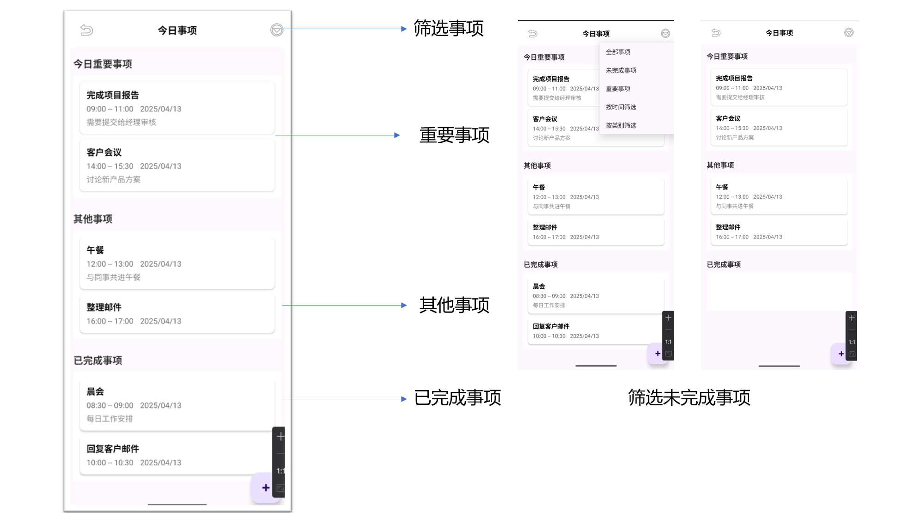
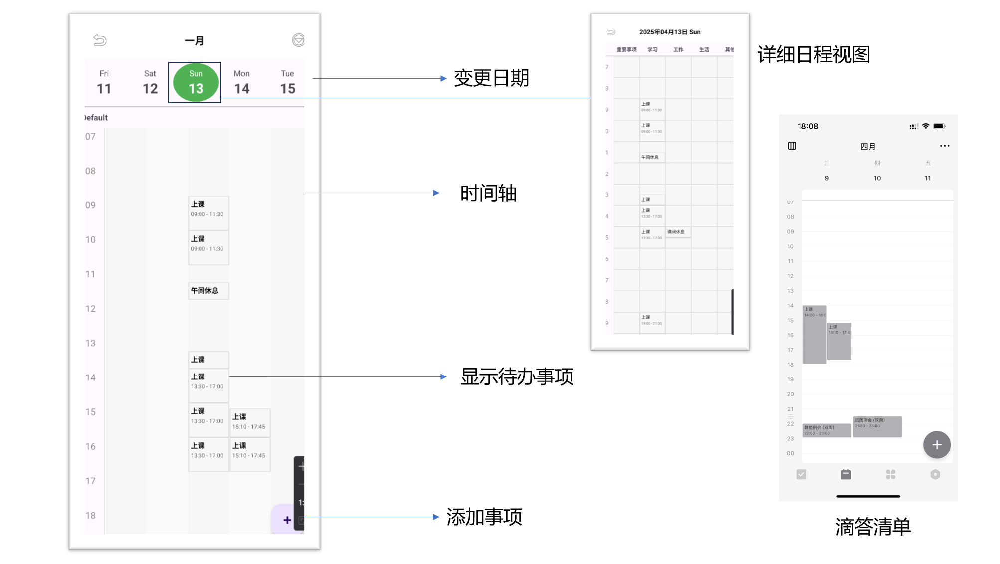
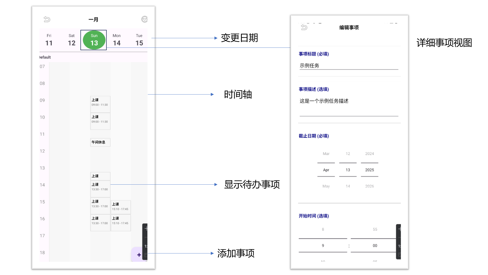
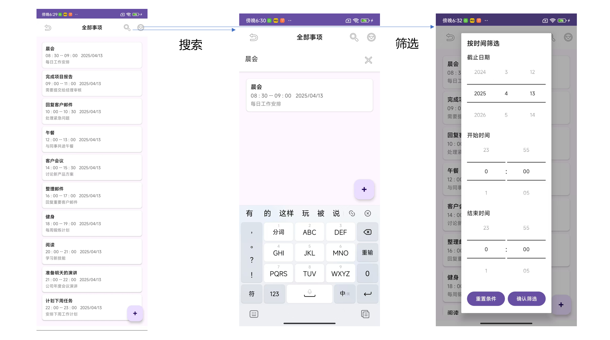
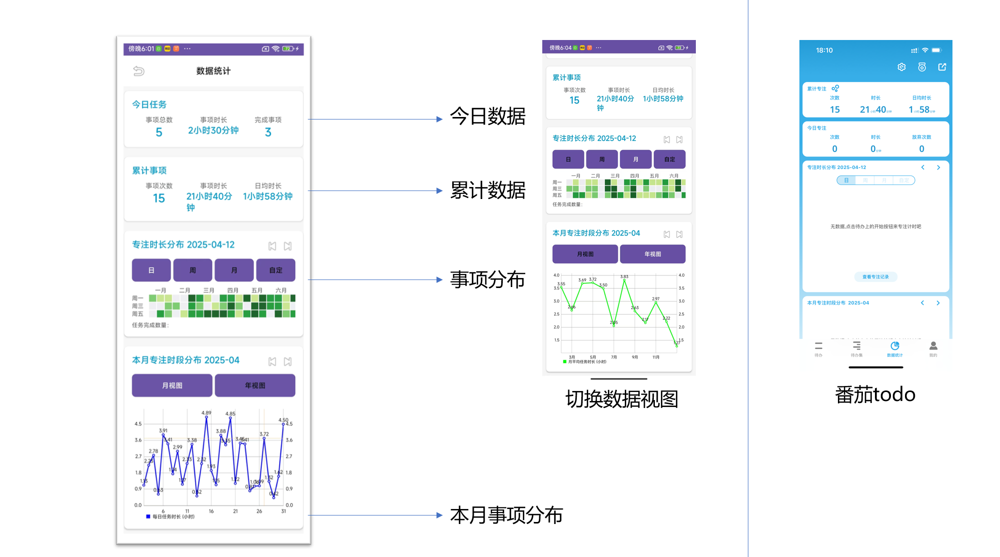
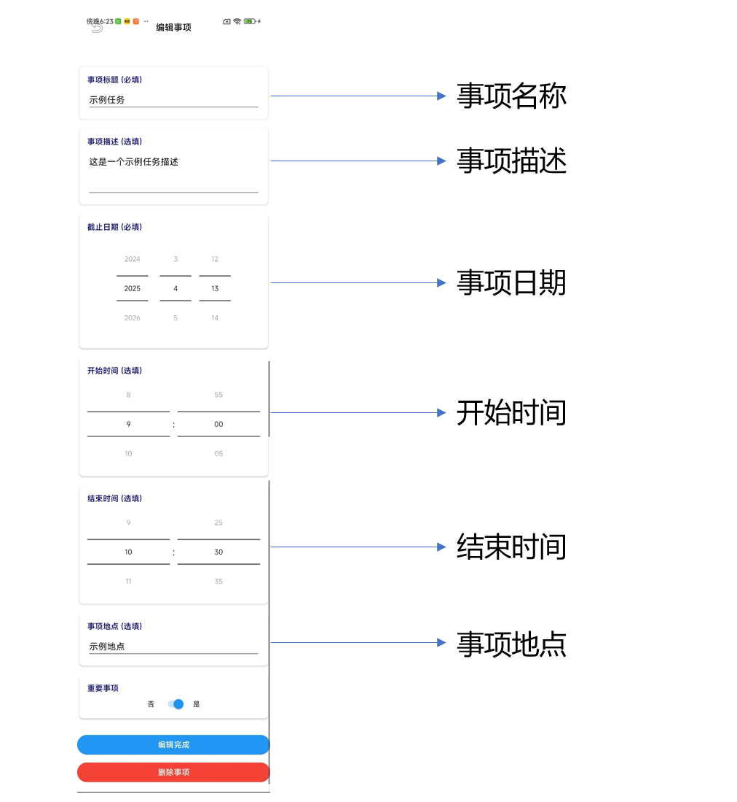
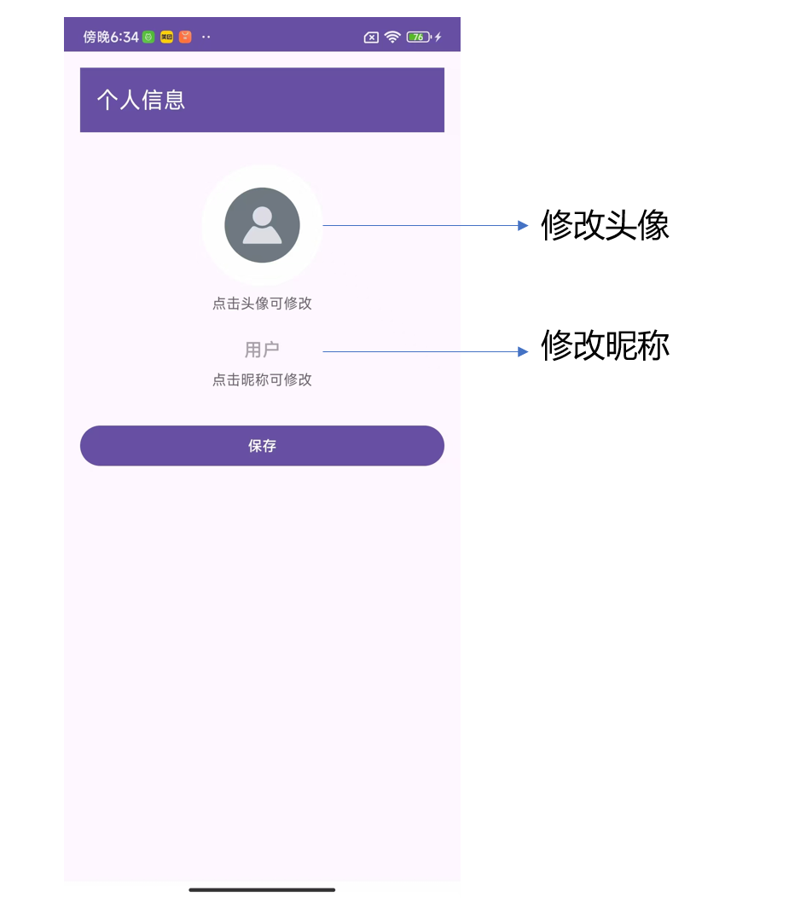

# TrickleDown-todolist
移动应用软件开发项目

## 一、项目概述

- 项目名称
  + 我们的项目名称为`TrickleDown-todolist`
  + 项目地址为`https://github.com/Alchuang22-dev/TrickleDown-todolist.git`

- 项目背景与意义
  - 我们注意到目前热门的TODO-list型软件（如`滴答清单`，`番茄todo`等）在面向用户的便利性和图形化的展示界面方面仍然存在一些不足，因此计划开发一款功能完备、设计简洁的轻量级待办清单软件。
- 项目目标
  - 我们希望结合TODO-list的优势（如任务管理的简洁性）和手账型软件的优势（如任务自定义的丰富性），设计适用于用户日常生活需求的实用型工具。
- 开发团队
- 开发进度概述

## 二、需求分析

### 1. 系统角色

我们的项目暂定分为两种用户角色，包含

- 普通用户
- 管理员用户

### 2. 用户故事

由于我们所创建的待办事项APP在市场具备较为成熟的方案，基本的用户故事包括：

- 作为用户，我希望能创建待办事项，以便记录需要完成的任务
- 作为用户，我希望能设置任务优先级和截止日期，以便合理规划时间
- 作为用户，我希望能对任务进行分类管理，以便更好地组织不同类型的任务
- 作为用户，我希望能接收任务到期提醒，以免错过重要事项
- 作为用户，我希望能查看任务完成统计，以了解自己的工作效率
- 作为管理员，我希望能管理用户账户，以确保系统正常运行

### 3. 功能点清单

#### 3.1 用户信息管理

+ 用户的注册、登录和登出
+ 用户个人信息编辑、保存、修改

### 3.2 任务管理

+ 任务状态：创建、删除、标记完成、解除标记完成
+ 编辑任务内容：标题、详情
+ 任务属性：时间（必有日期、可选时间点或时段）、地点（可选）、分类标签（有默认选项，可另行自定义）、优先级（重要or普通）
+ 任务排序：时间顺序，制作可视化时间轴（类似研讨室预约）
+ 任务筛选：默认查看全部事项，可使用未完成筛选（所有未完成的任务）、完成筛选（所有已完成的任务）、优先级筛选（所有重要事项）、类别筛选（提供所有标签供用户选择）、时间范围筛选（截止时间）；在主页单独设置今日任务列表
+ **重叠处理**：
  + 把一天视为时间轴，按5分钟划分为小时间段；一天内的重要事项不可重叠；
  + 允许一天内除重要事项外，同一时段最多重叠4个事项（重要事项单独置于最左一列，其余事项可占用右侧四列；添加事项时，若为重要事项，则检测重要事项列是否有空闲，无空闲则提醒需要更换时间或修改优先级；若非重要事项，则检测事项所需的时间段，自动最左填充，先考虑最左侧列是否有空闲时间，若没有则顺延；若同一时段重叠非重要事项超过4个，提醒事项过多，不允许新添加；若事项仅精确到日期、未精确到时间点或时间段，不放到本列表中，放置到今日事项中并显示距离目标日期还剩几天）
+ **任务视图**：
  + 提供今日任务（包含仅精确到日期、未精确到时间点或时间段的事项）；
  + 可选列表视图（默认按截止时间顺序展示所有事项，每页最多展示8-10个，可换页；可进行任务筛选）、看板视图（类似info的周视图；一天一列，每列仅展示重要事项；点击日期tab可进入该日详情，展示上面提到的重叠列表）

### 3.3 提醒系统

+ 包含推送通知+闹钟双提醒方式
+ 可选择是否对某一事项进行提醒
+ 可选择是否对某一事项周期提醒（每日、每周、每月、每年等）

### 3.4 数据统计

+ 今日完成率和累计完成率统计
+ 准时完成率和延后完成率统计
+ 其他的个性化分析

### 3.5 数据同步

+ 云端存储和多设备同步

## 三、界面设计

### 1. 登录与注册界面

- 暂未实现

### 2. 主界面

### 3. 今日任务界面

### 4. 计划看板界面

### 5. 全部任务界面

### 6. 数据统计界面

### 7. 添加任务

### 8. 用户界面

## 四、关键Activity及实现方式

### 1. 登录与注册Activity

- 实现方法与流程
  - 我们预期将实现账户/密码登录和微信登录两种登录方式
  - 关于账户/密码登录的微信登录，我们在软件工程项目中已经完成了相应的方法

- 关键技术点
  - user数据库和更新处理与token的自动更新和检测

### 2. 主界面Activity

- 实现方法与流程
  - 我们预期在主界面中展示用户所有的待办任务，以列表或卡片的方式呈现。
  - 通过RecyclerView搭配自定义Adapter实现高效的任务数据展示。
  - 用户可以通过下拉刷新控件（SwipeRefreshLayout）手动刷新任务列表。
- 关键技术点
  - 使用ViewModel搭配LiveData管理任务数据，确保数据与界面自动保持同步。
  - 数据异步加载：通过Coroutine或RxJava实现数据的异步加载，避免阻塞主线程，确保界面流畅。

### 3. 任务管理Activity

- 实现方法与流程
  - 提供CRUD（创建、读取、更新、删除）操作界面，允许用户对任务进行便捷管理。
  - 使用FloatingActionButton (FAB) 或标准按钮跳转到任务创建或编辑界面。
- 关键技术点
  - 任务状态管理：在任务数据模型中添加明确的状态标记（如“待完成”、“进行中”、“已完成”），在数据库和本地缓存中进行相应标记。
  - 使用Room数据库持久化任务信息，并在CRUD操作完成后自动更新ViewModel中对应的LiveData，保证数据实时同步。

### 4. 提醒服务

- 本地提醒实现方式
  - 闹钟：我们会使用`AlarmManager`监听用户任务的进程；在用户同意的情况下，我们将会向最近任务应用中添加白名单，将需要的应用添加到白名单中，保持应用进程在后台持续运行。
  - 通知：我们会使用`NotificationManager`设置通知内容，在本地对用户进行提醒。

- 推送通知实现方案
  - 日历维护：在获取日历权限后，我们会使用`ContentValues`和`ContentResolver`在服务器维护一个`Android Calendar`的对象，使用Android日历功能将用户的待办事项进行云同步，即使用户在本地完全关闭应用，也可以收到通知。

### 5. 数据同步Activity

- 实现方法与流程
  - 提供云端数据同步功能，允许用户主动触发数据同步或自动执行后台同步任务。
  - 使用RESTful API实现与云端服务器的数据交互。
- 关键技术点
  - 同步策略：使用WorkManager定期执行数据同步任务，并利用网络约束条件（如仅WiFi下同步），提升效率并减少流量消耗。
  - 冲突解决方案：在本地和服务器端记录数据版本或时间戳，当数据冲突时，采用“最近一次修改优先”原则或提供手动选择冲突处理的界面，由用户确定最终同步版本。

## 五、项目主要模块设计

### 1. 前端模块

- UI组件架构
  - **Jetpack Compose** - Google推荐的现代声明式UI工具包，能轻松实现拖拽功能和复杂动画
  - **Material Design 3** - 提供美观一致的UI组件和设计语言

- 状态管理方案
  - **Kotlin Flow/StateFlow** - 响应式编程处理应用状态（现阶段我们已经转向Java开发）
  - **LiveData** - 生命周期感知的数据持有者类

- 路由导航设计
  - **Jetpack Navigation** - 简化Fragment间导航，支持安全参数传递

- 本地存储设计
  - **DataStore**

### 2. 后端模块

- 数据模型设计
  - 我们目前只完成了`Task`类和`User`类以及包含的方法

- API接口设计
  - 请参见我们的Apifox文档

- 数据库结构
  - **MongoDB**

- 服务器架构
  - 我们正在使用的服务器后端为Ubuntu上的**Gin/Gorm**架构
  - 视情况使用**Firebase**

### 3. 数据流设计

- 前后端数据交互流程
- 数据处理逻辑

## 六、当前遇到的问题与解决方案

### 1. 技术难点

- 多设备数据同步问题
- 离线使用与数据一致性问题
- 解决方案与进展

### 2. 开发过程中的挑战

- 用户体验优化问题
- 性能优化问题
- 解决方案与进展

### 3. 可能遇到的问题

- 数据安全与隐私保护
- 系统扩展性考虑
- 预防措施与应对方案

## 七、下一阶段工作计划

- 功能开发计划
- 测试计划
- 发布时间表

## 八、附录

- 技术栈说明
- 开发环境配置
- API文档
- 数据库设计文档